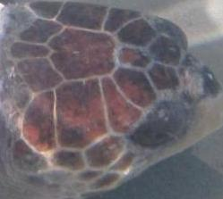

# AnimalCLEF25-CVPR-FGVC-LifeCLEF

This repository contains our code, models, and example data for the AnimalCLEF25 challenge.  

---

## 1. Installation

All installation steps (environment setup, required libraries, etc.) are provided in the first code cell of each notebook when opened in Google Colab:

- **Code.ipynb** (ResNet & DINO workflows)  
- **MegaDescriptor.ipynb** (our contrastive-learning–based descriptor)

Just click **“Open in Colab”**, run the first cell, and you’ll have everything you need.

---

## 2. Advanced Algorithms & Models

We submit only the **trained models** (no training code required). You can find:

- **ResNet-50** fine-tuned checkpoints in `resnet_model_history/`  
- **DINOv2** pre-trained embeddings in `dino_model_history/`  
- **MegaDescriptor** models in `MegaModel/` (with its own README)

To inspect how inference is done, see the commented sections in:
- `Code.ipynb`  
- `MegaDescriptor.ipynb`

---

## 3. Test / Validation Examples

A few sample images for quick testing. For example:

  

---

## 4. Running Inference

Each notebook includes clear, in-line comments showing how to:

1. **Load** the trained model  
2. **Prepare** a batch of test images  
3. **Run** the model on those images  
4. **Output** CSV submissions  

---

## Folder Structure
AnimalCLEF25-CVPR-FGVC-LifeCLEF/
├── Code.ipynb
├── MegaDescriptor.ipynb
├── data_process_analysis.ipynb
├── Presentation.pdf
├── Score.xlsx
├── result/
│   ├── submission_round1.csv
│   └── submission_round2.csv
├── resnet_model_history/
│   ├── resnet_epoch_10.pth
│   └── resnet_epoch_20.pth
├── dino_model_history/
│   ├── dino_pretrained.pth
│   └── dino_finetuned.pth
├── MegaModel/
│   ├── megadescriptor_final.pth
│   └── README.md
└── test_images/
    ├── zebra_01.jpg
    └── toucan_02.jpg

---

### Leaderboard Scores

