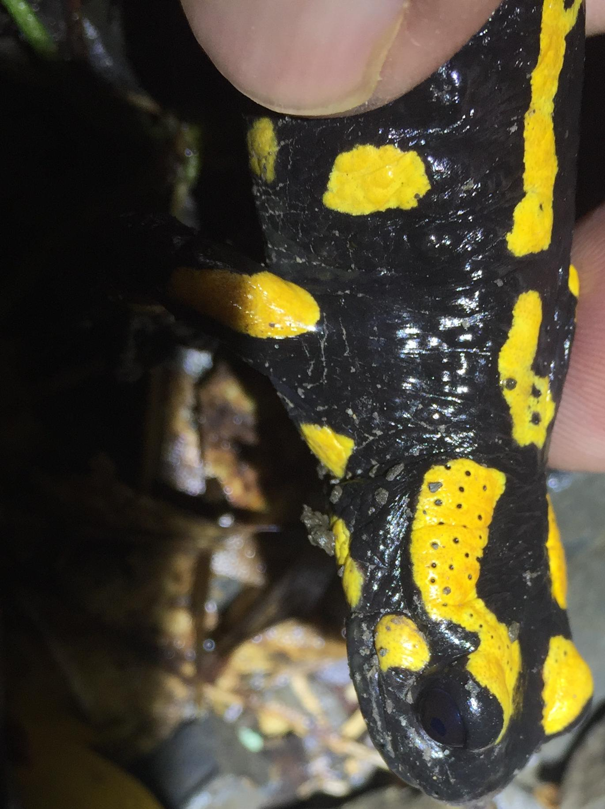
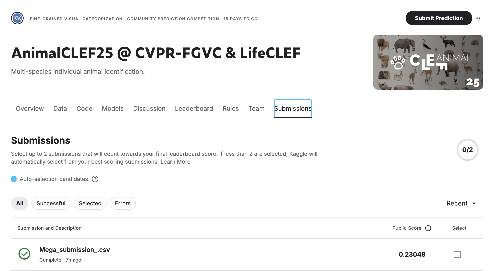
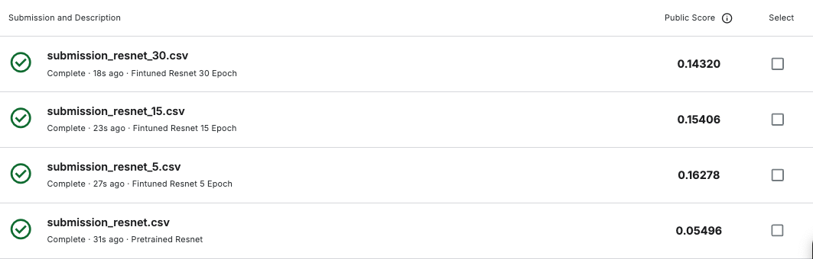

# AnimalCLEF25-CVPR-FGVC-LifeCLEF

This repository contains our code, models, and example data for the AnimalCLEF25 challenge.  

---

## 1. Installation

All installation steps (environment setup, required libraries, etc.) are provided in the first code cell of each notebook when opened in Google Colab:

- **Code.ipynb** (ResNet & DINO workflows)  
- **MegaDescriptor.ipynb** (our contrastive-learning–based descriptor)

Just click **“Open in Colab”**, run the first cell, and you’ll have everything you need.

---

## 2. Advanced Algorithms & Models

We submit only the **trained models** (no training code required). You can find:

- **ResNet-50** fine-tuned checkpoints in `resnet_model_history/`  
- **DINOv2** pre-trained embeddings in `dino_model_history/`  
- **MegaDescriptor** models in `MegaDescriptor.ipynb`

---

## 3. Test / Validation Examples

A few sample images for quick testing. For example:

  
  
  

---

## 4. Running Inference

In `ResNet_Dino.ipynb` it includes clear, in-line comments showing how to:

6. **Ensemble Model Prediction**
7. **Single Model Prediction**

In `MegaDescriptor.ipynb` it includes clear, in-line comments showing how to:

1. **Load** the trained model  
2. **Prepare** a batch of test images  
3. **Run** the model on those images  
4. **Output** CSV submissions  

---

## File description
- `data_process_analysis.ipynb` — Data preprocessing  

- `ResNet_Dino.ipynb` — Code for ResNet and DINO models  
    - `resnet_model_history/` — Fine-tuned ResNet checkpoints  
    - `dino_model_history/` — DINO model files  

- `MegaModel/` — Code for MegaDescriptor  
  1. Upload your dataset to the repo root  
  2. Update the `DATA_PATH` variable at the top of the notebook  
  3. Run all cells  
  - `Mega_Embedding_Id/` — Embeddings and identities for the dataset

- `result/` — Submission CSV files to the website  
- `Presentation.pdf` — Slides for presentation  
- `Score.xlsx` — Scores of the experiment  
---

### Leaderboard Scores

